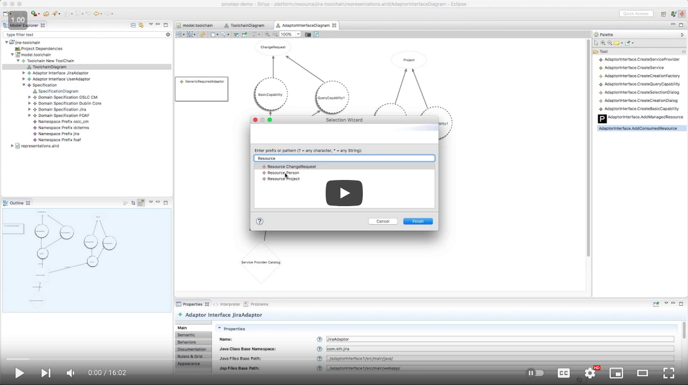

[](https://github.com/eclipse/lyo)
[](https://download.eclipse.org/lyo/product/binaries/stable/)
[](https://download.eclipse.org/lyo/product/binaries/edge/)

[](https://ci.eclipse.org/lyo/job/lyo-designer-master/)
[](https://forum.open-services.net/)


This repository contains the [Eclipse Lyo](https://projects.eclipse.org/projects/technology.lyo) Designer library.

Lyo Designer is an Eclipse plugin that allows one to graphically model (1) the overall system architecture, (2) the information model of the RDF resources being shared, and (3) the individual services and operations of each Server in the system. 

Lyo Designer includes a integrated code generator that synthesizes the model into almost-complete OSLC4J-compliant running implementation.

### Command-line code generation

After building Lyo Designer with JDK 17, the code generator can be run without
starting Eclipse:

```powershell
.\scripts\Invoke-LyoDesignerCodeGenerator.ps1 `
    -ModelPath C:\src\oslc\refimpl\model\toolchain.xml `
    -OutputDirectory C:\src\oslc\refimpl\model `
    -DomainModelsSource C:\src\oslc\lyo\domains\org.eclipse.lyo.tools.domainmodels `
    -JavaHome C:\Java\jdk-17 `
    -Build
```

The script supports Windows PowerShell 5.1 and PowerShell 7. It uses the
repository build's model classes ahead of the packaged Designer plug-ins.
Because domain-model references are resolved relative to the input model
project, the script copies `org.eclipse.lyo.tools.domainmodels` next to that
project when needed, then invokes
`org.eclipse.lyo.oslc4j.codegenerator.main.HeadlessGenerator`. On later runs,
omit `-Build` and `-DomainModelsSource` if the build output and copied domain
models are already present. The script warns when generation creates `.lost`
files that may contain user-code blocks requiring manual recovery. Use `Get-Help
.\scripts\Invoke-LyoDesignerCodeGenerator.ps1 -Full` for all options.

A short [video demonstration of Lyo Designer](https://www.youtube.com/watch?v=tZxPzlSTdeM):

[](https://www.youtube.com/watch?v=tZxPzlSTdeM)

## Introduction

The [Eclipse Lyo](https://projects.eclipse.org/projects/technology.lyo) project is focused on providing an SDK to enable adoption of [OSLC specifications](https://open-services.net/). OSLC (Open Services for Lifecycle Collaboration) is an open community dedicated to reducing barriers for lifecycle tool integration. The community authors specifications for exposing lifecycle artifacts through uniform (REST) interfaces and relying on Internet and Linked Data standards.

OSLC's scope started with Application Lifecycle Management (ALM) and is expanding to include integrations across Product Lifecycle Management (PLM) and IT Service Management (ISM/DevOps), Lyo is designed to be a companion to the continuing specification efforts of the OSLC community. Its main purpose is to expand adoption of OSLC specifications and to enable the Eclipse community to easily build OSLC compliant tools.

## Installation

See [Lyo Designer installation guide](http://oslc.github.io/developing-oslc-applications/eclipse_lyo/install-lyo-designer.html) for complete details.

## Tutorials and Documentation

You can find more resources for developing OSLC applications with Lyo and Lyo Designer, under the [OSLC Developer Guide](http://oslc.github.io/developing-oslc-applications/eclipse_lyo/eclipse-lyo#lyo-designer).
* How to [model a toolchain with Lyo Designer](http://oslc.github.io/developing-oslc-applications/eclipse_lyo/toolchain-modelling-workshop.html), and generate an initial code base
* How to [model domain specifications with Lyo Designer](http://oslc.github.io/developing-oslc-applications/eclipse_lyo/domain-specification-modelling-workshop.html), and generate OSLC4J-annotated Java classes to reflect the defined OSLC Resources. 
* Some [FAQs](https://github.com/eclipse/lyo.designer/wiki/FAQ).
* [Working with Lyo Designer from source code](https://github.com/eclipse/lyo.designer/wiki/Working-from-Source-Code)

You are also welcome to contact the development team via [lyo-dev mailing list](https://dev.eclipse.org/mailman/listinfo/lyo-dev)

## Contributing

See [contributing](https://github.com/eclipse/lyo#contributing) under the main [Eclipse Lyo](https://github.com/eclipse/lyo) repository.
